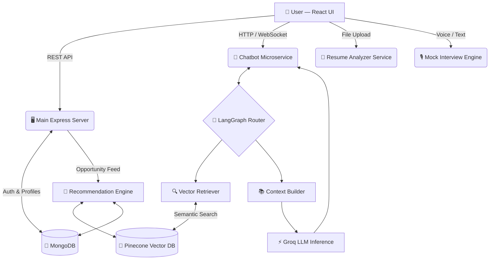

<div align="center">

<!-- BANNER SUGGESTION: A wide banner (1280x640px) with a dark navy/saffron gradient,
     showing diverse Indian workers (construction worker, nurse, student, IT professional)
     with glowing AI circuit lines connecting them. Text: "SkillRise India – Careers for Every Indian." -->


# 🚀 SkillRise India

### *AI-powered career guidance for every Indian — blue-collar, grey-collar, and beyond.*

<br/>

[](https://reactjs.org/)
[](https://nodejs.org/)
[](https://mongodb.com/)
[](https://pinecone.io/)
[](https://groq.com/)
[](./LICENSE)
[]()

<br/>

[✨ Features](#-core-features) · [🏗️ Architecture](#️-system-architecture) · [⚙️ Installation](#️-installation-guide) · [🤖 How AI Works](#-how-ai-works-in-this-project) · [🤝 Contributing](#-contributing)

</div>

---

## 📌 The Problem

> **Millions of capable workers in India are left behind — not due to lack of skill, but lack of structured guidance.**

India's workforce is vast and diverse, yet the career-tech ecosystem almost exclusively serves white-collar IT professionals. The ground-level reality is stark:

- 🔴 Blue-collar workers have **no structured platform** for upskilling or job discovery
- 🔴 Grey-collar professionals (technicians, healthcare aides, retail workers) are **invisible to modern job platforms**
- 🔴 Students from Tier 2 and Tier 3 cities face a **massive guidance vacuum**
- 🔴 Existing tools cannot handle **non-standard career paths** or regional nuances
- 🔴 Resume tools and interview coaches are designed **only for corporate, English-first profiles**

---

## 💡 Solution Overview

**SkillRise India** is a full-stack, AI-driven career platform that serves *every* Indian worker — regardless of education, language, or collar color.

It combines the power of **Large Language Models**, **semantic vector search**, and **multi-agent orchestration** to deliver hyper-personalized career guidance at scale. From a construction worker seeking a foreman certification to a nursing student preparing for interviews — SkillRise adapts to you.

---

## ✨ Core Features

<details>
<summary><strong>🤖 AI Career Chatbot (Multi-Agent System)</strong></summary>

<br/>

A LangGraph-orchestrated, context-aware chatbot that remembers your profile, past conversations, and career goals. Unlike generic bots, it routes your queries to specialized sub-agents:

- **Career Advisor Agent** — Long-term roadmap planning
- **Job Search Agent** — Targeted opportunity matching via vector search
- **Skill Coach Agent** — Gap analysis and course recommendations
- **Interview Prep Agent** — Domain-specific question generation

It uses **Hybrid Memory** — combining MongoDB (structured history) with Pinecone (semantic recall) — to deliver responses that feel like talking to a knowledgeable mentor, not a chatbot.

</details>

<details>
<summary><strong>🎯 Smart Job & Opportunity Recommendations</strong></summary>

<br/>

An intelligent recommendation feed that doesn't just match keywords — it understands *context*. Powered by Sentence Transformer embeddings and Pinecone, it surfaces:

- Localized job openings (city/state-aware)
- NGO-run training camps and career drives
- Government skill development programs
- Upskilling courses ranked by relevance to your current profile

</details>

<details>
<summary><strong>📄 Resume Analyzer</strong></summary>

<br/>

Upload your resume and receive:

- An **ATS compatibility score** (0–100) benchmarked against industry standards
- A precise list of **missing keywords** for your target role
- Section-by-section **actionable improvements**
- Suggestions tailored for blue-collar and grey-collar formats — not just IT profiles

Supports PDF and DOCX formats.

</details>

<details>
<summary><strong>🎙️ Real-Time Mock Interview Engine</strong></summary>

<br/>

An interactive Voice/Text AI agent that conducts live mock interviews:

- Dynamically adapts questions based on your **live answers**
- Covers both **technical** and **behavioral** dimensions
- Provides instant, structured **feedback reports**
- Supports domain-specific tracks (trades, healthcare, hospitality, IT, retail, etc.)

</details>

<details>
<summary><strong>📊 Skill Gap Analyzer</strong></summary>

<br/>

Maps your current skill profile against target job requirements and outputs:

- A **visual skill gap heatmap**
- Ranked list of skills to acquire (by impact)
- Recommended resources for each gap (courses, NGOs, YouTube, etc.)

</details>

<details>
<summary><strong>🏢 NGO Ecosystem & Dashboard</strong></summary>

<br/>

A dedicated portal where verified NGOs can:

- Post career camps, training drives, and skill programs
- Target postings by region, skill category, and user profile
- View engagement analytics for their posted opportunities

All NGO content is surfaced in the main recommendation feed for relevant users.

</details>

<details>
<summary><strong>🏛️ Government Admin Panel</strong></summary>

<br/>

A secure, role-based administration interface where government administrators can:

- Verify and register NGOs on the platform
- Monitor NGO activity and impact metrics across states
- Manage platform-level configurations

</details>

<details>
<summary><strong>📱 Personalized Dashboard</strong></summary>

<br/>

Every user gets a dynamic home dashboard showing:

- Recommended jobs and opportunities (updated in real-time)
- Resume health score and improvement suggestions
- Upcoming NGO events nearby
- Progress tracking on skill roadmaps

</details>

---

## 🏗️ System Architecture

### High-Level Workflow



### LangGraph Multi-Agent Orchestrator and Vector DB Flow


> *Diagram illustrating the LangGraph orchestrator routing queries to specialized agents, fetching context from MongoDB and Pinecone, and generating sub-100ms responses via Llama 3 on Groq.*

### Service Ports at a Glance

| Service | Port | Description |
|---|---|---|
| React Frontend | `5173` | User-facing web application |
| Main Backend | `8000` | Auth, profiles, NGO/Admin APIs |
| Chatbot Service | `5000` | LangGraph AI agent microservice |
| Mock Interview | `5050` | Real-time interview engine |
| Resume Analyzer | `5001` | Document parsing and scoring |

---

## 🤖 How AI Works in This Project

### 1. Personalization Engine Flow

```
User Profile + History
        │
        ▼
Sentence Transformer Embeddings
        │
        ▼
Pinecone Vector Search ──► Top-K Semantic Matches
        │
        ▼
Groq LLM (Llama 3) ──► Re-ranked, Profile-Aware Response
        │
        ▼
Personalized Feed / Recommendation
```

Every interaction refines the user's vector profile. The system learns your preferences — without ever needing explicit ratings or form fills.

### 2. Agentic Chatbot Architecture


### 3. Hybrid Memory & Semantic Search

| Memory Layer | Technology | Purpose |
|---|---|---|
| Short-term | In-memory (session) | Active conversation context |
| Structured | MongoDB | User profiles, chat logs, NGO data |
| Semantic | Pinecone + Sentence Transformers | Long-term recall, job/course matching |

The combination allows the chatbot to recall *what you said three weeks ago* as naturally as what you said three messages ago — essential for ongoing career journeys that span months.

---

## 🧱 Tech Stack

| Layer | Technology | Purpose |
|---|---|---|
| **Frontend** | React.js, Vite, Tailwind CSS, Framer Motion | Fast, animated, responsive UI |
| **Backend** | Node.js, Express.js | API routing, authentication, business logic |
| **Primary Database** | MongoDB, Mongoose | User profiles, chat logs, NGO/Admin data |
| **Vector Database** | Pinecone | Semantic search, long-term memory |
| **Embeddings** | Sentence Transformers | Text → vector conversion for search |
| **LLM Inference** | Groq API (Llama 3) | Ultra-fast language model responses |
| **AI Orchestration** | LangGraph | Multi-agent routing and state management |
| **Auth** | JWT + RBAC Middleware | Secure, role-based access control |

---

## 🖼️ Screenshots

> A dark-themed, modern UI designed for clarity and accessibility across all user types.

<br/>

### 🏠 User Dashboard & Navigation


> *Personalized home dashboard greeting users by name, with quick-access core modules — AI Recommendations, Resume Analyzer, and Personalized Feed.*

<br/>

### 🔐 Authentication


> *Clean sign-in screen with email/password and Google OAuth. Tagline: "Sign in to continue your career journey."*

<br/>

### 👤 User Profile


> *Complete profile view showing education, work experience, key skills, profile strength indicator (100%), and uploaded resume — all in one place.*

<br/>

### 🤖 Agentic Career Chatbot


> *The Career Assistant interface with suggested quick-start prompts: Learning Roadmap, Skill Gap Analysis, and Interview Prep.*

<br/>

### 🎯 AI Recommendations & Trajectory Analysis


> *Dynamic Trajectory Analysis powered by vector embeddings — surfaces best-matched opportunities with up to 99% match scores based on user's skill profile.*

<br/>

### 📰 Personalized Feed


> *Semantic feed with match scores for each content card — covering electrician jobs, solar panel training, logistics roles, carpentry, and more, all ranked for the individual user.*

<br/>

### 🗺️ Career Roadmap Generator


> *Generate a month-by-month career roadmap for any target role. Optionally update it by uploading your current resume for a gap-aware plan.*

<br/>

### 📄 AI Powered ATS Resume Checker


> *Upload PDF, DOCX, or TXT resumes. The AI analyzes against modern ATS systems and provides compatibility scores, missing keywords, and professional suggestions.*

<br/>

### 🎙️ Mock Interview Engine


> *Track all past interview sessions with scores, completion rates (85%), and average performance (72/100). Filter by Technical, Behavioral, or Mixed sessions.*

<br/>

### 💬 Community Feedback


> *"Share Your Insights" — users can rate their experience and report bugs or request features, directly influencing platform development.*

<br/>

### 🏢 NGO Dashboard — Blog Posts


> *NGOs can create and publish career blogs with AI-generation support. Live feed shows posts on electrician careers, solar panel installation, carpentry, and computer literacy.*

<br/>

### 🏢 NGO Dashboard — Programs


> *Post training programs with skills, eligibility, location, and deadline. Live programs shown: Solar Panel Installation Workshop (Kanpur) and Basic Electrician Training (Lucknow).*

<br/>

### 🏢 NGO Dashboard — Opportunities


> *Quick post interface for job and training opportunities, with type selection, skills, location, deadline, and apply link fields.*

<br/>

### 🏛️ Government Admin Dashboard


> *Real-time platform overview — 16 total users, 10 registered NGOs, 1 active state, top demand skill tracking, India user distribution heatmap, skills distribution charts, and trending skills with live demand analysis.*

<br/>

### 🏛️ Admin — NGO Registration


> *Secure NGO onboarding form — organization name, contact email, temporary password, and organization type. One-click registration with role-based access provisioning.*

---

> 📁 **To add screenshots:** Place your image files in a `screenshots/` folder at the root of the repository using the filenames referenced above.

---

## ⚙️ Installation Guide

> SkillRise India uses a **multi-service microservice architecture**. You must run all services concurrently across separate terminals.

### Prerequisites

- Node.js `v18+`
- npm `v9+`
- MongoDB (local or Atlas URI)
- Pinecone account + index created
- Groq API key
- Google Generative AI API key (for Gemini integrations)

### Step 1 — Clone the Repository

```bash
git clone https://github.com/Shreya2776/SkillRise_India.git
cd SkillRise_India
```

### Step 2 — Environment Configuration

Create a `.env` file in each service directory using the table below:

| Directory | Variable | Description |
|---|---|---|
| `backend/` | `MONGO_URI` | MongoDB connection string |
| `backend/` | `JWT_SECRET` | Cryptographic secret for token signing |
| `agentic-chatbot/backend/` | `GROQ_API_KEY` | Groq cloud inference API key |
| `agentic-chatbot/backend/` | `PINECONE_API_KEY` | Pinecone vector database API key |
| `client/` | `VITE_API_URL` | Main backend URL (e.g. `http://localhost:8000`) |
| `client/` | `VITE_CHATBOT_URL` | Chatbot backend URL (e.g. `http://localhost:5000`) |
| `new_mock/server/` | `GOOGLE_GENERATIVE_AI_API_KEY` | Gemini API key for interview engine |

### Step 3 — Start All Services

Open **5 separate terminal windows** and run the following:

**Terminal 1 — Frontend**
```bash
cd client
npm install
npm run dev
# → http://localhost:5173
```

**Terminal 2 — Main Backend**
```bash
cd backend
npm install
npm run dev
# → http://localhost:8000
```

**Terminal 3 — AI Chatbot Service**
```bash
cd agentic-chatbot/backend
npm install
npm run dev
# → http://localhost:5000
```

**Terminal 4 — Mock Interview Engine**
```bash
cd new_mock/server
npm install
npm run dev
# → http://localhost:5050
```

**Terminal 5 — Resume Analyzer**
```bash
cd resume_analyser/backend
npm install
npm run dev
# → http://localhost:5001
```

> ✅ Once all services are running, open `http://localhost:5173` in your browser to use the platform.

---

## 📖 Usage Guide

### For Job Seekers

1. **Sign up** and complete your profile (skills, location, education, work history)
2. Explore your **Personalized Dashboard** — jobs and opportunities are surfaced immediately
3. Upload your **Resume** for an instant ATS score and improvement tips
4. Chat with the **AI Career Chatbot** to map out your next steps
5. Run a **Mock Interview** in your target domain to build confidence
6. Browse **NGO opportunities** for free training programs near you

### For NGOs

1. Request registration through the platform
2. Receive verification from a Government Admin
3. Access the **NGO Dashboard** to post drives, camps, and programs
4. Monitor engagement metrics for posted opportunities

### For Government Admins

1. Log in to the **Admin Panel** (restricted access)
2. Review and **verify NGO registration requests**
3. Monitor platform-wide NGO activity and impact data

---

## 🗂️ Folder Structure

```
SkillRise_India/
│
├── client/                          # React + Vite Frontend
│   └── src/
│       ├── components/              # Shared UI components (Navbar, Cards, etc.)
│       ├── pages/                   # Main user-facing screens
│       ├── admin/                   # Government Admin Dashboard
│       └── ngo/                     # NGO Management Interface
│
├── backend/                         # Primary Application Server
│   └── src/
│       ├── models/                  # Mongoose Schemas (User, Opportunity, NGO, Post)
│       ├── controllers/             # Route handlers and business logic
│       └── middlewares/             # JWT auth, RBAC, error handling
│
├── agentic-chatbot/                 # LangGraph Multi-Agent AI Engine
│   └── backend/
│       ├── agents/                  # Individual agent definitions
│       ├── memory/                  # Hybrid memory (Mongo + Pinecone)
│       └── routes/                  # Chat API endpoints
│
├── resume_analyser/                 # Resume Parsing & ATS Scoring Service
│   └── backend/
│       ├── parsers/                 # PDF / DOCX parsing logic
│       └── scoring/                 # ATS scoring and gap detection
│
└── new_mock/                        # Real-Time Voice/Text Interview Engine
    └── server/
        ├── interview/               # Question generation and session management
        └── feedback/                # Answer evaluation and report generation
```

---

## 🔌 API Overview

<details>
<summary><strong>Auth & User Endpoints (Main Backend — :8000)</strong></summary>

| Method | Endpoint | Description |
|---|---|---|
| `POST` | `/api/auth/register` | Register a new user |
| `POST` | `/api/auth/login` | Login and receive JWT |
| `GET` | `/api/user/profile` | Get current user profile |
| `PUT` | `/api/user/profile` | Update user profile |

</details>

<details>
<summary><strong>Chatbot Endpoints (:5000)</strong></summary>

| Method | Endpoint | Description |
|---|---|---|
| `POST` | `/api/chat` | Send message, receive AI response |
| `GET` | `/api/chat/history` | Retrieve conversation history |
| `DELETE` | `/api/chat/reset` | Clear session context |

</details>

<details>
<summary><strong>Resume Analyzer Endpoints (:5001)</strong></summary>

| Method | Endpoint | Description |
|---|---|---|
| `POST` | `/api/resume/analyze` | Upload and analyze a resume |
| `GET` | `/api/resume/report/:id` | Retrieve a previous analysis report |

</details>

<details>
<summary><strong>Mock Interview Endpoints (:5050)</strong></summary>

| Method | Endpoint | Description |
|---|---|---|
| `POST` | `/api/interview/start` | Start a new interview session |
| `POST` | `/api/interview/answer` | Submit an answer and get next question |
| `GET` | `/api/interview/feedback/:id` | Retrieve full session feedback |

</details>

---

## 🔮 Future Enhancements

- [ ] **WhatsApp API Integration** — Allow blue-collar users without smart devices to interact via SMS/WhatsApp
- [ ] **Regional Language Support** — Native multilingual chatbot (Hindi, Tamil, Bengali, Telugu, and more)
- [ ] **Offline Mode** — PWA capabilities for low-connectivity rural environments
- [ ] **Web3 Certificate Verification** — Immutable, blockchain-backed NGO-issued skill certificates
- [ ] **Employer Portal** — Allow verified companies to directly post jobs and access candidate profiles
- [ ] **Mobile App** — React Native app for wider accessibility
- [ ] **Gamified Skill Tracks** — Badges, streaks, and leaderboards to drive skill development engagement

---

## 🤝 Contributing

Contributions are what make open-source great. We welcome all contributions — from documentation fixes to major feature additions.

```bash
# 1. Fork the repository

# 2. Create your feature branch
git checkout -b feature/YourFeatureName

# 3. Commit your changes with a descriptive message
git commit -m "feat: add regional language support to chatbot"

# 4. Push to your branch
git push origin feature/YourFeatureName

# 5. Open a Pull Request on GitHub
```

Please read our [Contributing Guidelines](./CONTRIBUTING.md) and [Code of Conduct](./CODE_OF_CONDUCT.md) before submitting.

> 💡 **First-time contributor?** Look for issues labeled `good first issue` or `help wanted`.

---

## 📜 License

Distributed under the **MIT License**. See [`LICENSE`](./LICENSE) for full terms.

---

## 👥 Team & Credits

<div align="center">

Built with ❤️ for India's workforce by the SkillRise India team.

*Special thanks to the open-source communities behind LangGraph, Groq, Pinecone, and Sentence Transformers — whose tools made this vision possible.*

---

**⭐ If SkillRise India resonates with you, please star the repository. It helps more people discover the project.**

[](https://github.com/Shreya2776/SkillRise_India)

</div>
